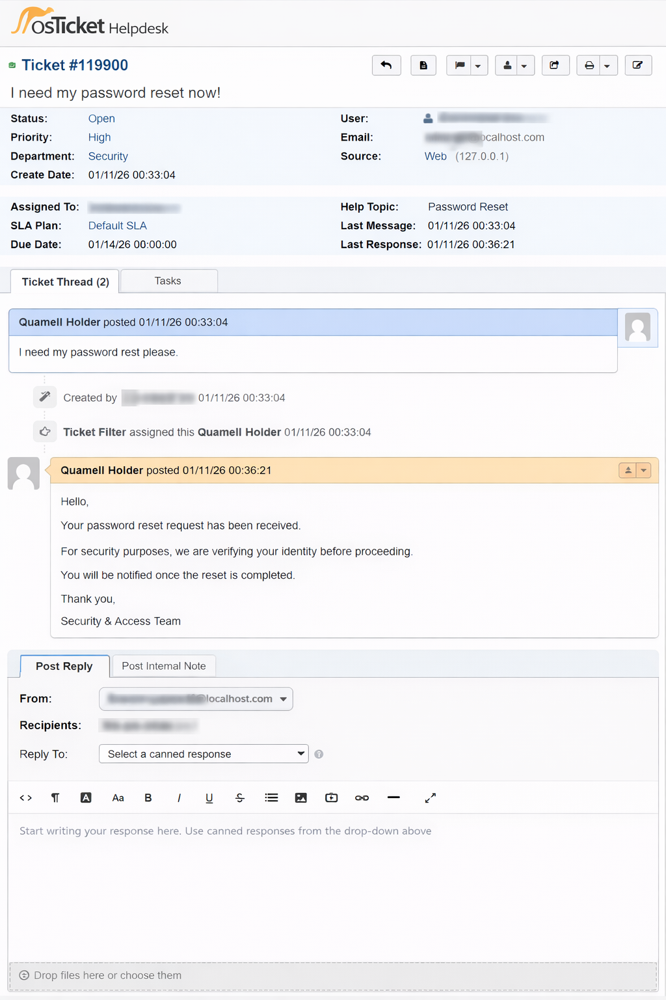
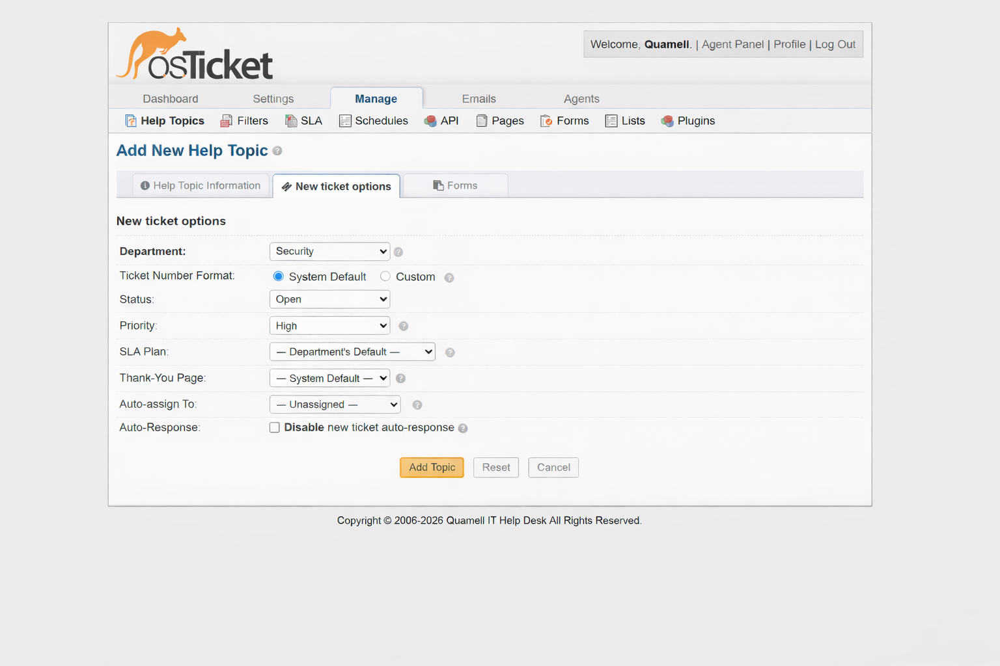

# osticket-helpdesk-lab
Hands-on osTicket help desk lab demonstrating ticket workflows, agent responses, and system configuration.
# osTicket Help Desk Lab

## 📌 Overview
This project demonstrates the installation, configuration, and operation of an **osTicket Help Desk system** in a local lab environment. The lab simulates real-world IT support workflows, including ticket intake, agent response, help topic configuration, and system-level troubleshooting.

The goal of this project is to showcase **hands-on Help Desk and IT Support skills**, not just theory.

---

## 🛠️ Technologies Used
- **osTicket** v1.18.2
- **XAMPP** (Apache, MySQL, PHP)
- **Windows 10**
- Localhost environment (127.0.0.1)
- Visual Studio Code (configuration editing)

---

## ⚙️ Features & Tasks Demonstrated
- Successful osTicket installation and post-install verification
- User-submitted support ticket (Password Reset scenario)
- Agent-side ticket review and response workflow
- Help Topic creation and configuration (Security Department)
- Priority and SLA awareness
- Configuration file modification for debugging and troubleshooting
- Secure handling and sanitization of sensitive information

---

## 🖼️ Screenshots

### osTicket Installation Completed (Local Lab)

### Password Reset Ticket – User Submission

### Password Reset Ticket – Agent Response

### Help Topic Configuration – Password Reset (Security Department)

### osTicket Configuration File – Debug Mode Enabled

> 🔐 All screenshots have been sanitized to remove sensitive information such as email addresses, usernames, IP addresses, and system identifiers.

---

## 🧠 Skills Demonstrated
- Help Desk & IT Support Operations
- Ticket Lifecycle Management
- Incident & Request Handling
- osTicket Administration
- User Communication & Documentation
- System Configuration & Troubleshooting
- Security Awareness & Best Practices
- GitHub Documentation & Portfolio Presentation

---

## 🚀 Future Enhancements
- Email integration for ticket notifications
- SLA escalation rules and breach simulation
- Role-based agent permissions
- Additional help topics and departments
- Rep
